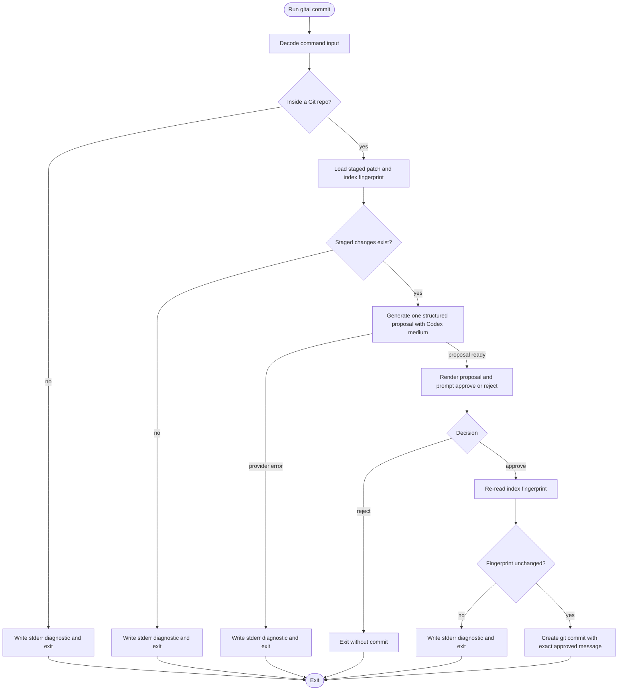
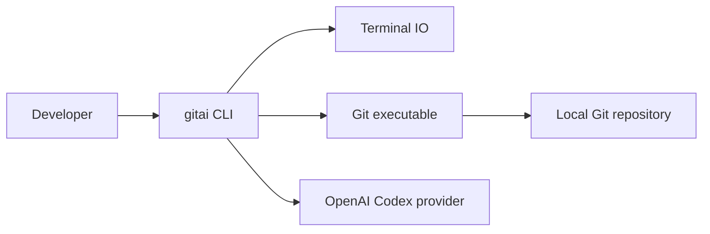

# Approval View

## Cross-Artifact Coherence

- The charter, stories, requirements, and design all align on one bounded `gitai commit` slice: staged changes in, one proposal out, then approve or reject.
- The user-visible contract stays stable across artifacts: one optional instruction string, one proposal, binary review, and fail-closed aborts for invalid Git or provider conditions.
- The technical design refines rather than expands scope: Effect v4 plus Bun plus explicit service boundaries implement the already approved behavior and add fingerprint revalidation to protect message-to-diff fidelity.

### Visual Evidence

- Source: /Users/urbanfaubion/.supacode/repos/gitai/init-authoring/.specs/gitai/technical-design.md :: Process Flowchart

- Source: /Users/urbanfaubion/.supacode/repos/gitai/init-authoring/.specs/gitai/technical-design.md :: Context Flowchart

## Scope Continuity Matrix

| Concern                   | Charter                                                                                         | User stories                                                                   | Requirements                                                                          | Technical design                                                                                                     |
| ------------------------- | ----------------------------------------------------------------------------------------------- | ------------------------------------------------------------------------------ | ------------------------------------------------------------------------------------- | -------------------------------------------------------------------------------------------------------------------- |
| Proposal input scope      | Goals fix staged Git changes as the input to the flow.                                          | US1.1 and US1.3 observe one proposal from the staged diff in the current repo. | FR1.1 and DR4.1 restrict generation to the currently staged changes.                  | `GitRepository` loads the staged patch and index fingerprint before generation.                                      |
| Review contract           | SC1.3 makes the outcome binary: approve commits; reject aborts.                                 | US1.4 and US1.5 make approval and rejection observable.                        | FR1.3-FR1.5 and DR4.3 bind review to one immutable proposal snapshot.                 | `CommitWorkflow` keeps rejection out of the error channel and gates commit creation on approval.                     |
| Failure contract          | SC1.4 requires aborts for invalid repo context, missing staged changes, and generation failure. | US1.6-US1.8 cover the three abort stories.                                     | FR1.6-FR1.8 and NFR2.1-NFR2.3 require stderr diagnostics and no commit.               | Process flow and error model route those failures directly to stderr without commit creation.                        |
| Invocation context        | Goals and SC1.5 require PATH-based use relative to the current working directory.               | US1.3 covers running from the current repo directory or a nested subdirectory. | FR1.1, NFR2.4, and DEP6.2 require cwd-relative repo resolution and PATH availability. | `CommitCommand` and `GitRepository` take cwd as input and resolve repo scope from there.                             |
| Default generation policy | SC1.6 fixes Codex-medium as the default generation behavior.                                    | The story set leaves provider choice out of user-visible behavior.             | TC3.6 makes Codex-medium an explicit technical constraint.                            | Architecture summary and provider integration set the default model layer to Codex-family OpenAI with medium effort. |

## Decision Gates before Implementation

- Scope lock
  - Confirm the charter still accurately bounds the first release to one staged-diff-driven `gitai commit` flow.
- User-visible behavior lock
  - Confirm the story set is complete with one optional instruction string, one proposal, binary review, and three explicit abort cases.
- Requirement baseline lock
  - Confirm the obligation set, runtime constraints, and dependency prerequisites are acceptable as the implementation contract.
- Design boundary lock
  - Confirm the `CommitCommand` / `CommitWorkflow` / `GitRepository` / `CommitMessageGenerator` split is the intended implementation seam map.
- Safety lock
  - Confirm fingerprint revalidation remains required before any commit is created from an approved proposal.

## Unresolved Cross-Artifact Pressure Points

- Provider credentials, configuration, and network access remain explicit runtime prerequisites for the approved flow.
- Fingerprint revalidation can abort after review if the staged set changes, so implementation and tests must preserve that fail-closed behavior.

## Downstream Impact if Approved

- Implementation can proceed against one stable scope, behavior, obligation, and architecture pack.
- Execution planning and task generation can reference approved `US1.x`, `FR1.x`, and component boundaries without reopening product scope.
- Verification can target the binary review contract, exact-message commit behavior, and typed Git or provider failure paths defined across the pack.

## Traceability Map

- [T1] Claim: The product scope is a single `gitai commit` flow that turns staged changes into a proposed commit message.
  - Source: /Users/urbanfaubion/.supacode/repos/gitai/init-authoring/.specs/gitai/charter.md :: Goals
  - Evidence quote: "- Provide a `gitai commit` CLI flow that turns currently staged Git changes into a proposed commit message for user review."
- [T2] Claim: The user-visible review contract is binary: approve or reject.
  - Source: /Users/urbanfaubion/.supacode/repos/gitai/init-authoring/.specs/gitai/requirements.md :: Functional Requirements
  - Evidence quote: "- FR1.3: After generating a proposal, the product shall present the proposal for review and accept only two user decisions for that proposal: approve or reject."
- [T3] Claim: The pack requires abort behavior for missing repo context, missing staged changes, and provider failures.
  - Source: /Users/urbanfaubion/.supacode/repos/gitai/init-authoring/.specs/gitai/requirements.md :: Functional Requirements
  - Evidence quote: "- FR1.8: If commit-message generation fails because of a model or provider error, the product shall abort the flow, write a diagnostic error to stderr, and create no commit."
- [T4] Claim: The technical stack is fixed to Effect v4, Bun, and a thin request-scoped CLI workflow.
  - Source: /Users/urbanfaubion/.supacode/repos/gitai/init-authoring/.specs/gitai/technical-design.md :: Architecture Summary
  - Evidence quote: "- Summary: `gitai` is a thin Effect CLI runtime edge over one request-scoped commit workflow. Durable capabilities live in a `GitRepository` service and a `CommitMessageGenerator` service. The workflow loads the staged patch and an index fingerprint from the current repository, asks the model for one schema-validated proposal using the default Codex-medium configuration, renders that exact proposal for review, revalidates the staged fingerprint on approval, and then either creates the commit or exits without one."
- [T5] Claim: Default generation uses Codex with medium thinking effort.
  - Source: /Users/urbanfaubion/.supacode/repos/gitai/init-authoring/.specs/gitai/charter.md :: Success Criteria
  - Evidence quote: "- SC1.6: Default commit-message generation uses Codex with thinking level set to medium when the user does not override behavior with extra instruction text."
- [T6] Claim: The pack keeps provider exposure limited to the staged patch and the optional instruction string.
  - Source: /Users/urbanfaubion/.supacode/repos/gitai/init-authoring/.specs/gitai/technical-design.md :: Security, Reliability, and Performance
  - Evidence quote: "- Only the staged patch text and the optional instruction string leave the local machine for generation; unstaged and untracked changes stay out of scope by construction."

## Validator Status

- Canonical validator:
  - Command: bash .agents/skills/write-charter/scripts/validate_charter.sh .specs/gitai/charter.md && bash .agents/skills/write-user-stories/scripts/validate_user_stories.sh .specs/gitai/user-stories.md && bash .agents/skills/write-requirements/scripts/validate_requirements.sh .specs/gitai/requirements.md && bash .agents/skills/write-technical-design/scripts/validate_technical_design.sh .specs/gitai/technical-design.md
  - Result: Passed
- Approval-view validator:
  - Command: bash .agents/skills/write-approval-view/scripts/validate_approval_view.sh pack .specs/gitai/approval/pack.md .specs/gitai/approval/pack.html .specs/gitai/charter.md .specs/gitai/user-stories.md .specs/gitai/requirements.md .specs/gitai/technical-design.md
  - Result: Passed

## Snapshot Identity

- Review type: Pack
- Approval mode: Initial
- Spec-pack root: /Users/urbanfaubion/.supacode/repos/gitai/init-authoring/.specs/gitai
- Pack snapshot SHA-256: add41b99f3a81ca38310b5004bd0f1e17d6825a4090fff559fea91916c93c4f5
- Approval view generated_at: 2026-04-16T20:50:28Z
- Included snapshots:
  - /Users/urbanfaubion/.supacode/repos/gitai/init-authoring/.specs/gitai/charter.md | SHA-256: 630c23c14c9672362bfa448fbf7fbfb6e57e6fdbcf649d328720eabd1c3ff073 | updated_at: 2026-04-15T12:54:58Z
  - /Users/urbanfaubion/.supacode/repos/gitai/init-authoring/.specs/gitai/requirements.md | SHA-256: 3982144bebceadb77aeba18dd4e1676b0d694aeefd2e8b1b9543a98c1cc99eb0 | updated_at: 2026-04-15T16:57:52Z
  - /Users/urbanfaubion/.supacode/repos/gitai/init-authoring/.specs/gitai/technical-design.md | SHA-256: 773e0f148744f46d12c5ebfe135a614def01e92a409f4c44fccefcc80462202d | updated_at: 2026-04-15T17:11:04Z
  - /Users/urbanfaubion/.supacode/repos/gitai/init-authoring/.specs/gitai/user-stories.md | SHA-256: aac6f61a7dbadee2b1a2916195fd7933ac040eecbee4046632639f2c200cf554 | updated_at: 2026-04-15T14:16:15Z
