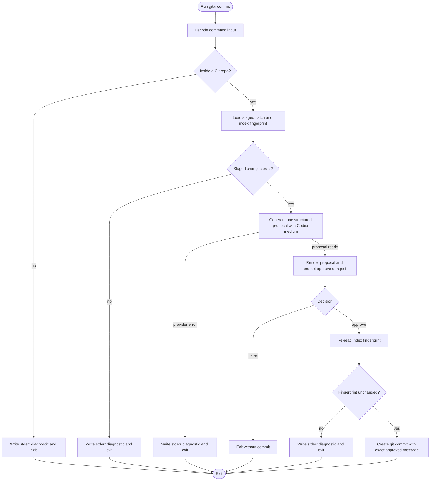
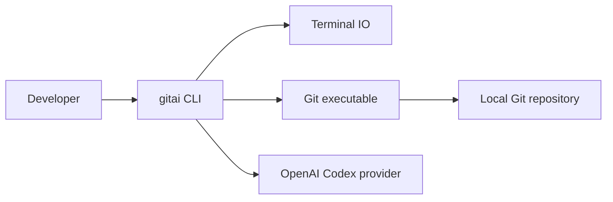
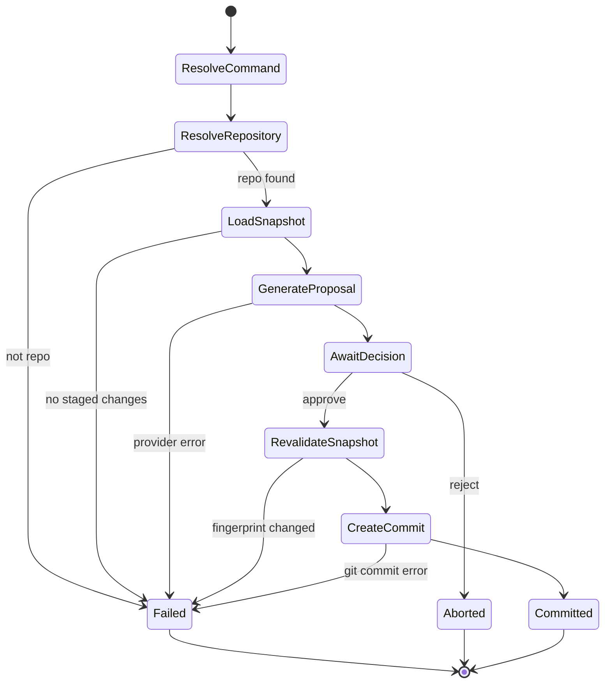

# Approval View

## Architecture and Runtime Model

- `gitai` stays a thin Effect CLI runtime edge over one request-scoped `CommitWorkflow`.
- `GitRepository` and `CommitMessageGenerator` isolate the only durable external boundaries: local Git state and provider-backed proposal generation.
- Approval revalidates the staged index fingerprint before commit creation so the reviewed proposal cannot drift from the staged content.

### Visual Evidence

- Source: /Users/urbanfaubion/.supacode/repos/gitai/init-authoring/.specs/gitai/technical-design.md :: Process Flowchart

- Source: /Users/urbanfaubion/.supacode/repos/gitai/init-authoring/.specs/gitai/technical-design.md :: Context Flowchart

- Source: /Users/urbanfaubion/.supacode/repos/gitai/init-authoring/.specs/gitai/technical-design.md :: Behavior State Diagram

### Review Notes

- Inspect ownership boundaries first: CLI parsing and rendering stay in the command edge, repo semantics stay in `GitRepository`, and provider access stays in `CommitMessageGenerator`.
- Confirm the request-scoped flow keeps user rejection out of the error channel and keeps commit creation gated by fingerprint revalidation.

## Boundaries, Interfaces, and Data Flow

| Boundary                 | Owned capability                                                                                     | Key inputs / outputs                                                                                                                                        | Approval read                                                                        |
| ------------------------ | ---------------------------------------------------------------------------------------------------- | ----------------------------------------------------------------------------------------------------------------------------------------------------------- | ------------------------------------------------------------------------------------ |
| `CommitCommand`          | Parse `gitai commit`, invoke the workflow once, and centralize terminal rendering.                   | Inputs: argv, cwd, terminal services. Outputs: proposal display, prompt, stderr diagnostics, process exit.                                                  | Keeps CLI concerns at the runtime edge instead of leaking them into services.        |
| `CommitWorkflow`         | Orchestrate one commit session from snapshot load through review decision and final commit or abort. | Inputs: instruction string, `GitRepository`, `CommitMessageGenerator`, prompt helpers. Outputs: `Committed` or `Rejected`, plus typed operational failures. | Owns the request-scoped state machine and binary review contract.                    |
| `GitRepository`          | Resolve repo scope, load the staged patch, capture the index fingerprint, and create the commit.     | Inputs: cwd, git executable, approved proposal text. Outputs: `StagedSnapshot`, commit side effects, typed Git failures.                                    | Hides Git child-process and temp-file mechanics behind semantic repository behavior. |
| `CommitMessageGenerator` | Build the prompt, invoke the model, decode structured output, and map provider failures.             | Inputs: `StagedSnapshot`, optional instruction, `GitAiConfig`, `LanguageModel`. Outputs: immutable `CommitProposal`, typed generator failures.              | Keeps model policy and provider access out of CLI and Git boundaries.                |
| Request-scoped data flow | Move from invocation input to staged snapshot to proposal to review decision to commit outcome.      | Inputs: optional instruction and staged patch. Outputs: one immutable proposal and, only on approval, one exact-message commit.                             | Makes illegal intermediate states hard to represent and easy to test.                |

## Implementation Seams and Operational Hand-Offs

- Composition root in `src/index.ts`
  - The entrypoint assembles the root command, application layer, and `BunRuntime.runMain`, then hands one parsed invocation into `CommitWorkflow`.
- Git boundary seam
  - `GitRepository.layer` owns repo discovery, staged snapshot loading, fingerprinting, temp message file lifecycle, and `git commit --file` execution.
- Provider boundary seam
  - `CommitMessageGenerator.layer` owns OpenAI model configuration, `LanguageModel.generateObject`, structured decode, and provider error mapping.
- Terminal and stderr seam
  - The command edge renders the proposal and review prompt to stdout-facing surfaces while operational failures go to stderr-facing output paths.

## Major Risks and Tradeoffs

- Using Git child processes keeps behavior aligned with the user's real repository state, but it adds a hard dependency on the installed `git` executable.
- Structured object generation reduces malformed commit output, but it adds a render step between model output and Git commit creation.
- Revalidating the staged fingerprint protects message-to-diff fidelity, but it can abort if the staged set changes during review.
- Very large staged diffs can exceed provider limits and surface as provider failure instead of hidden truncation.

## Decisions Required for Approval

- Architecture split
  - Approve the boundary split between `CommitCommand`, `CommitWorkflow`, `GitRepository`, and `CommitMessageGenerator`.
- Safety contract
  - Approve staged-index fingerprint revalidation as the protection that keeps the approved message bound to the reviewed staged content.
- Runtime stack
  - Approve Effect CLI plus Bun plus a Codex-family OpenAI model configured for medium reasoning effort as the default runtime stack.

## Open Questions and TODO: Confirm Items

- None

## Traceability Map

- [T1] Claim: The core architecture is a thin CLI edge over a request-scoped workflow.
  - Source: /Users/urbanfaubion/.supacode/repos/gitai/init-authoring/.specs/gitai/technical-design.md :: Architecture Summary
  - Evidence quote: "- Summary: `gitai` is a thin Effect CLI runtime edge over one request-scoped commit workflow. Durable capabilities live in a `GitRepository` service and a `CommitMessageGenerator` service. The workflow loads the staged patch and an index fingerprint from the current repository, asks the model for one schema-validated proposal using the default Codex-medium configuration, renders that exact proposal for review, revalidates the staged fingerprint on approval, and then either creates the commit or exits without one."
- [T2] Claim: Git behavior is isolated behind a service that owns repo resolution, staged snapshot loading, and commit execution.
  - Source: /Users/urbanfaubion/.supacode/repos/gitai/init-authoring/.specs/gitai/technical-design.md :: GitRepository
  - Evidence quote: "- Owned capability: resolve repository scope from the current working directory, read the staged patch, capture an index fingerprint, and create a commit from an approved message."
- [T3] Claim: Proposal generation is isolated behind a service that owns prompt construction, model invocation, and structured decode.
  - Source: /Users/urbanfaubion/.supacode/repos/gitai/init-authoring/.specs/gitai/technical-design.md :: CommitMessageGenerator
  - Evidence quote: "- Owned capability: prompt construction, model invocation, structured output decoding, and provider error mapping."
- [T4] Claim: Approval must re-check the staged fingerprint before commit creation.
  - Source: /Users/urbanfaubion/.supacode/repos/gitai/init-authoring/.specs/gitai/technical-design.md :: Interfaces and Contracts
  - Evidence quote: "- Validation rules: the CLI parser rejects extra positional inputs; `GitRepository` must resolve a repo root and confirm staged content before generation; `CommitMessageGenerator` must decode one structured proposal; the approval path must re-check the index fingerprint before commit creation."
- [T5] Claim: The composition root is `src/index.ts` and owns Bun runtime and layer assembly.
  - Source: /Users/urbanfaubion/.supacode/repos/gitai/init-authoring/.specs/gitai/technical-design.md :: Implementation Strategy
  - Evidence quote: "- Recomposition sites: `src/index.ts` assembles the root command, the application layer, and `BunRuntime.runMain`; the `commit` command handler composes `CommitWorkflow` once per invocation; `GitRepository.layer` owns Git process helpers and temp-file cleanup; `CommitMessageGenerator.layer` owns OpenAI model configuration and request-time overrides."
- [T6] Claim: Only the staged patch and optional instruction cross the provider boundary.
  - Source: /Users/urbanfaubion/.supacode/repos/gitai/init-authoring/.specs/gitai/technical-design.md :: Security, Reliability, and Performance
  - Evidence quote: "- Only the staged patch text and the optional instruction string leave the local machine for generation; unstaged and untracked changes stay out of scope by construction."

## Validator Status

- Canonical validator:
  - Command: bash .agents/skills/write-technical-design/scripts/validate_technical_design.sh .specs/gitai/technical-design.md
  - Result: Passed
- Approval-view validator:
  - Command: bash .agents/skills/write-approval-view/scripts/validate_approval_view.sh artifact .specs/gitai/technical-design.md .specs/gitai/approval/technical-design.md .specs/gitai/approval/technical-design.html
  - Result: Passed

## Downstream Impact if Approved

- Implementation can wire the CLI entrypoint, Git boundary, provider boundary, and review workflow against stable ownership seams.
- Tests can target explicit request-scoped contracts for proposal generation, rejection, fingerprint drift, and exact-message commit behavior.
- Final pack review can treat architecture and runtime strategy as fixed enough for planning and task generation.

## Snapshot Identity

- Review type: Artifact
- Approval mode: Initial
- Canonical artifact: /Users/urbanfaubion/.supacode/repos/gitai/init-authoring/.specs/gitai/technical-design.md
- Snapshot SHA-256: 773e0f148744f46d12c5ebfe135a614def01e92a409f4c44fccefcc80462202d
- Canonical updated_at: 2026-04-15T17:11:04Z
- Approval view generated_at: 2026-04-16T20:50:28Z
