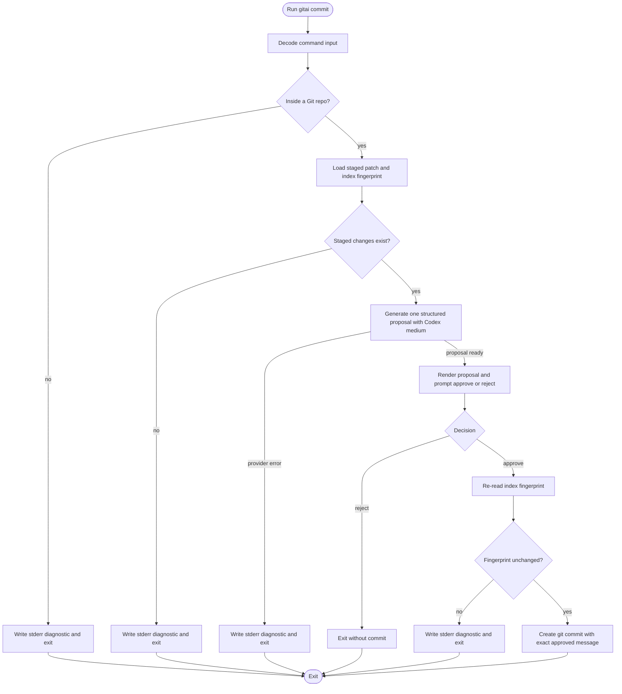
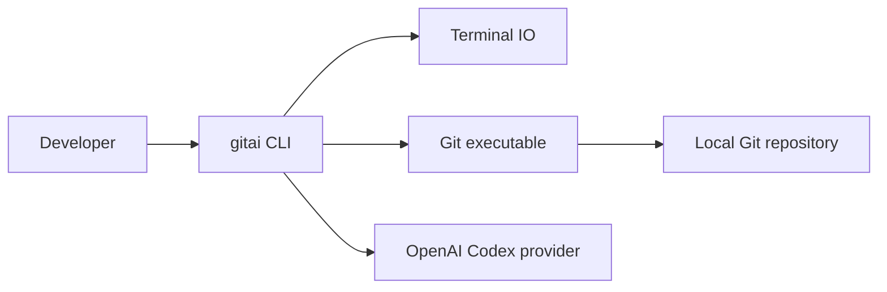
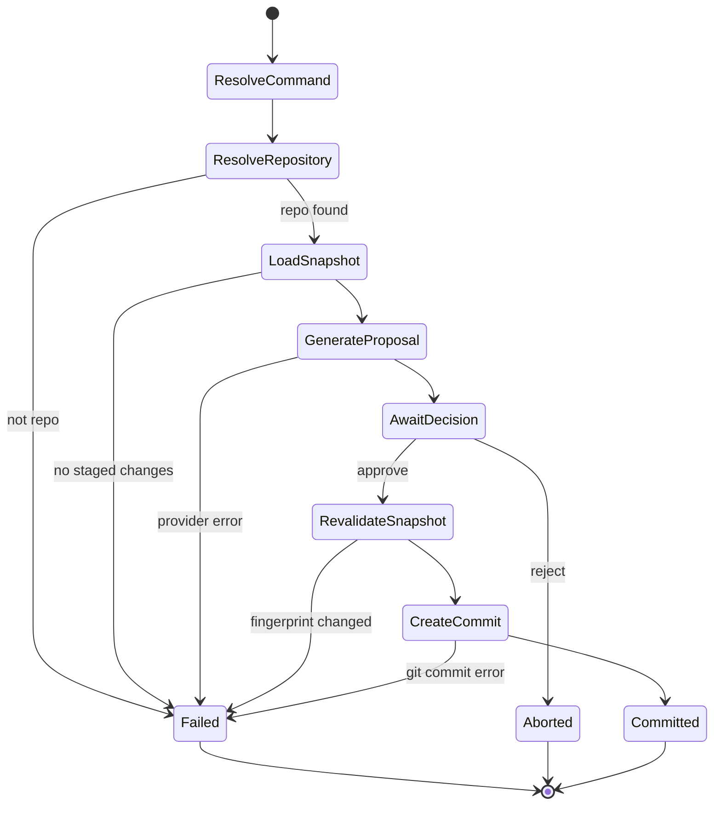
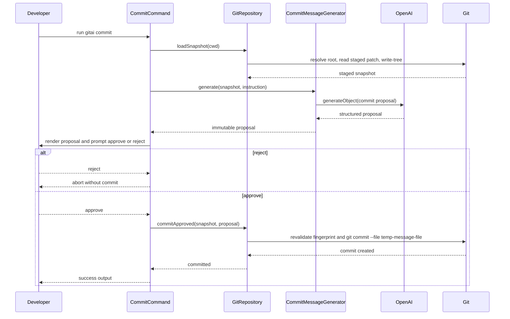

## Architecture Summary

- Runtime profile: CLI-only
- Composition root: `src/index.ts`, where the root command, application layer, and `BunRuntime.runMain` entrypoint are assembled.
- Main execution model: One-shot command invocation; each `gitai commit` run resolves current repository state, generates one proposal, waits for one review decision, then exits.
- Summary: `gitai` is a thin Effect CLI runtime edge over one request-scoped commit workflow. Durable capabilities live in a `GitRepository` service and a `CommitMessageGenerator` service. The workflow loads the staged patch and an index fingerprint from the current repository, asks the model for one schema-validated proposal using the default Codex-medium configuration, renders that exact proposal for review, revalidates the staged fingerprint on approval, and then either creates the commit or exits without one.

## System Context

- Primary user surface: the terminal command `gitai commit` with zero or one positional instruction string.
- External boundaries: terminal input and output, local Git executable, local Git repository state, and the OpenAI provider API.
- Story or requirements traceability: US1.1, US1.2, US1.3, US1.4, US1.5, US1.6, US1.7, US1.8; FR1.1, FR1.2, FR1.3, FR1.4, FR1.5, FR1.6, FR1.7, FR1.8; IR5.1, IR5.2, IR5.3, IR5.4

### Process Flowchart



### Context Flowchart



## Components and Responsibilities

### Behavior State Diagram



### CommitCommand

This runtime edge translates CLI parse results into one workflow invocation and centralizes process-level rendering.

- Boundary type: command handler
- Owned capability: decode the `commit` subcommand, invoke the request-scoped workflow once, and map outcomes or failures to terminal output.
- Hidden depth: CLI help behavior, argument parsing, runtime-provided process shutdown, and process-level exit handling.
- Inputs: argv, current working directory, Bun platform services, terminal services
- Outputs: proposal display, approval prompt, stderr diagnostics, process completion
- Story impact: US1.1, US1.2, US1.3, US1.4, US1.5; FR1.1, FR1.2, FR1.3

### CommitWorkflow

This feature module orchestrates one commit session without owning Git transport details or provider wiring.

- Boundary type: feature module
- Owned capability: request-scoped state machine from staged snapshot load through review decision and final commit or abort.
- Hidden depth: prompt assembly, immutable proposal lifetime, approval gating, and staged-index drift protection.
- Inputs: parsed instruction string, `GitRepository`, `CommitMessageGenerator`, terminal prompt helpers
- Outputs: `Committed` or `Rejected` outcomes, plus typed operational failures for invalid repo state, provider failure, or commit failure
- Story impact: US1.1, US1.4, US1.5, US1.6, US1.7, US1.8; FR1.3, FR1.4, FR1.5, FR1.6, FR1.7, FR1.8; DR4.3

### GitRepository

This capability service hides Git child-process mechanics behind semantic repository reads and commit execution.

- Boundary type: service
- Owned capability: resolve repository scope from the current working directory, read the staged patch, capture an index fingerprint, and create a commit from an approved message.
- Hidden depth: child-process spawning, Git exit-code parsing, temp-file handling for the exact commit message, and commit-time fingerprint revalidation.
- Inputs: current working directory, git executable, approved proposal text
- Outputs: `StagedSnapshot`, successful commit side effects, and typed Git failures
- Story impact: US1.1, US1.3, US1.4, US1.6, US1.7; FR1.1, FR1.4, FR1.6, FR1.7; IR5.1, IR5.2

### CommitMessageGenerator

This capability service turns a staged snapshot into one schema-validated commit proposal using the configured model layer.

- Boundary type: service
- Owned capability: prompt construction, model invocation, structured output decoding, and provider error mapping.
- Hidden depth: default model configuration, reasoning-effort override, prompt phrasing, and proposal rendering from structured fields.
- Inputs: `StagedSnapshot`, optional instruction string, `GitAiConfig`, `LanguageModel`
- Outputs: immutable `CommitProposal`, typed model or provider failures
- Story impact: US1.1, US1.2, US1.8; FR1.2, FR1.8; TC3.3, TC3.5, TC3.6; IR5.4

## Data Model and Data Flow

- Entities: `CommitInvocationInput`, `StagedSnapshot`, `CommitProposal`, `ReviewDecision`, and `CommitOutcome`.
- Flow: the CLI edge decodes the optional instruction string, `GitRepository` returns a staged snapshot with patch text and index fingerprint, `CommitMessageGenerator` converts that snapshot into a structured proposal, `CommitWorkflow` renders the proposal for review, and approval reuses the same snapshot fingerprint before commit creation.
- Observation support: stdout shows the proposal and success or abort notices, stderr carries operational failures, and Git commit creation is the authoritative observable success condition for US1.4.

The workflow keeps user rejection out of the error channel and binds approval to a fingerprinted staged snapshot. That makes it possible to distinguish user intent, operational failure, and commit creation without ambiguous intermediate states.

```ts
import { Schema } from "effect";

export const ReviewDecision = Schema.Union(
  Schema.TaggedStruct("Approve", {}),
  Schema.TaggedStruct("Reject", {}),
);

export const CommitOutcome = Schema.Union(
  Schema.TaggedStruct("Committed", {
    commitMessage: Schema.String,
  }),
  Schema.TaggedStruct("Rejected", {}),
);

export const StagedSnapshot = Schema.Struct({
  repoRoot: Schema.String,
  stagedPatch: Schema.String,
  indexFingerprint: Schema.String,
});
```

The `StagedSnapshot` record is request-scoped, not persisted, and can be passed across service boundaries without losing the exact patch and fingerprint that the proposal was built from.

### Entity Relationship Diagram

- Not needed: the design has no application-owned durable relational store; all domain records are request-scoped, and the only durable artifact is the Git commit written by Git itself.

## Interfaces and Contracts

- Interface: a root `gitai` command with a single `commit` subcommand, plus service contracts for `GitRepository` and `CommitMessageGenerator`.
- Accepted input grammar: `gitai commit` or `gitai commit "focus on test coverage"`; the command accepts zero or one positional instruction string and derives repository scope from the current working directory.
- Validation rules: the CLI parser rejects extra positional inputs; `GitRepository` must resolve a repo root and confirm staged content before generation; `CommitMessageGenerator` must decode one structured proposal; the approval path must re-check the index fingerprint before commit creation.
- Boundary errors: `NotGitRepositoryError`, `NoStagedChangesError`, `CommitMessageGeneratorError`, `IndexChangedDuringReviewError`, and `GitCommandError`.
- Trigger and boundary conditions: generation starts only after the staged snapshot loads; rejection returns a no-commit outcome; invalid Git context, missing staged changes, provider failures, and commit-time fingerprint drift go directly to stderr without creating a commit.

The generator boundary is the main place where Effect service ownership matters. It owns provider access and typed failure mapping, but it does not own Git transport, review prompting, or process exit policy.

```ts
import { Context, Effect, Schema } from "effect";
import { AiError } from "effect/unstable/ai";

export class CommitMessageGeneratorError extends Schema.TaggedErrorClass<CommitMessageGeneratorError>()(
  "CommitMessageGeneratorError",
  {
    reason: AiError.AiErrorReason,
  },
) {}

export class CommitMessageGenerator extends Context.Service<
  CommitMessageGenerator,
  {
    generate(
      snapshot: StagedSnapshot,
      instruction: string | undefined,
    ): Effect.Effect<CommitProposal, CommitMessageGeneratorError>;
  }
>()("@urban/gitai/CommitMessageGenerator") {}
```

The concrete implementation can call `LanguageModel.generateObject` and then render the validated result into the exact commit message string that is shown to the user and later passed to Git.

### Interaction Diagram



## Integration Points

- Bun runtime integration: `BunRuntime.runMain` owns process startup and shutdown, while `BunServices.layer` provides `ChildProcessSpawner`, `FileSystem`, `Path`, `Terminal`, and `Stdio`.
- Git integration: `GitRepository` uses child processes for `git rev-parse --show-toplevel`, `git diff --cached --no-ext-diff --binary`, `git write-tree`, and `git commit --file temp-message-file`.
- Provider integration: `OpenAiClient.layerConfig` supplies credentials, `FetchHttpClient.layer` provides HTTP transport, and the default model layer is a Codex-family OpenAI language model with `reasoning_effort` set to `medium`.
- Prompt integration: `Prompt.confirm` supplies the binary review gate with labels rendered as approve or reject instead of a free-form edit flow.

## Failure and Recovery Strategy

- Error model: operational failures are tagged errors at the service boundary for repo discovery, no staged changes, Git command execution, provider failure, and index drift; user rejection remains a `Rejected` outcome rather than an error.
- Degraded modes and recovery: the command fails before generation when Git preconditions are not met, fails after approval if `git write-tree` no longer matches the reviewed snapshot, and does not retry provider or Git failures automatically in the first release; recovery is operator-driven rerun after fixing repo state, staged content, credentials, or network conditions.

## Security, Reliability, and Performance

- Only the staged patch text and the optional instruction string leave the local machine for generation; unstaged and untracked changes stay out of scope by construction.
- Model output is treated as data, not executable behavior; Git side effects occur only after explicit approval.
- Exact message delivery uses a temp message file instead of shell-interpolated arguments, which preserves multiline formatting and avoids quoting hazards.
- Each invocation performs one staged snapshot read, one model request, one review prompt, and at most one commit attempt.
- Very large staged diffs can exceed provider limits; in the first release that surfaces as a provider failure instead of hidden truncation.

## Implementation Strategy

- Recomposition sites: `src/index.ts` assembles the root command, the application layer, and `BunRuntime.runMain`; the `commit` command handler composes `CommitWorkflow` once per invocation; `GitRepository.layer` owns Git process helpers and temp-file cleanup; `CommitMessageGenerator.layer` owns OpenAI model configuration and request-time overrides.
- Resource ownership: child processes are scoped through `ChildProcessSpawner`; the temporary commit-message file is request-scoped and deleted after commit attempt or abort; provider and HTTP client layers are runtime-wide capabilities provided once at the composition root.
- Direct runtime escape hatches: Bun process startup, Git child processes, provider network calls, and the CLI parser or prompt loop from `effect/unstable/cli` remain explicit boundaries instead of hidden helpers.
- Strategy: keep the runtime edge thin with `Command.make("gitai")` and a `commit` subcommand, keep provider and Git behavior behind `Context.Service` boundaries, and expose model defaults through a `Context.Reference` so the default Codex-medium pair can change without changing caller contracts.

## Testing Strategy

- Use `@effect/vitest` effect tests with layer substitution for workflow and service behavior.
- Unit tests cover prompt building, structured proposal rendering, rejection-as-outcome handling, and error-to-stderr mapping.
- Service tests cover `GitRepository` with stubbed `ChildProcessSpawner` and `FileSystem` layers for repo-missing, no-staged-changes, index-drift, and exact-message commit cases.
- Generator tests cover prompt construction, optional instruction inclusion, schema decode behavior, and `AiError` mapping by substituting a fake `LanguageModel`.
- Integration tests use temporary Git repositories and real child processes under Bun to verify current-working-directory repo resolution, staged diff capture, approve-creates-commit, reject-aborts-without-commit, and stderr failures.
- Verification focus: binary review contract, fail-closed behavior, exact approved message commit, and no commit creation after provider or Git precondition failures.

## Risks and Tradeoffs

- Using Git child processes keeps repository behavior aligned with the user’s actual Git environment and avoids bundling libgit behavior, but it adds a hard dependency on the installed `git` executable.
- Structured object generation makes malformed commit output less likely and keeps subject or body rendering explicit, but it adds a render step between model output and Git commit creation.
- Revalidating the staged fingerprint before commit protects message-to-diff fidelity, but it can abort if the user changes the staged set during review and must rerun the command.

## Further Notes

- Assumptions: provider credentials and network access are available through environment configuration; Bun can execute the installed CLI entrypoint; the first release keeps one default provider path instead of adding failover behavior.
- Open questions: None.
- TODO: Confirm: None.
